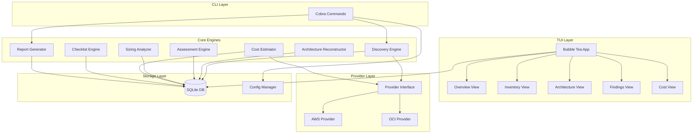

# Design Document: Agnostic Account Assessment (3A)

## Overview

3A is a modular, provider-agnostic cloud assessment tool built in Go. The architecture separates concerns into distinct engines connected through well-defined interfaces. A provider abstraction layer allows AWS and OCI implementations to be swapped or extended without affecting core assessment logic.

The system follows a pipeline pattern: Discovery → Reconstruction → Assessment/Sizing/Cost → Checklist → Report. Each stage reads from and writes to a shared SQLite database, enabling independent execution and historical review.

Key design decisions:
- **Provider interface abstraction**: All cloud-specific logic lives behind Go interfaces, making new provider support additive-only
- **SQLite as the canonical data store**: Enables offline review, historical comparison, and decouples the TUI from live API calls
- **Concurrent discovery with bounded parallelism**: Uses Go's goroutines with semaphore patterns to scan regions/compartments in parallel
- **Rule-based assessment engine**: Findings are generated by evaluating declarative rules against resource metadata
- **Bubble Tea component model**: Each TUI view is an independent model with its own Update/View cycle

## Architecture



### Project Structure

```
3a/
├── cmd/
│   └── 3a/
│       └── main.go              # Entry point
├── internal/
│   ├── cli/
│   │   ├── root.go             # Cobra root command
│   │   ├── assess.go           # assess command
│   │   ├── profiles.go         # profiles list/add commands
│   │   └── report.go           # report command
│   ├── config/
│   │   ├── config.go           # Config types and loader
│   │   └── profile.go          # Account profile management
│   ├── provider/
│   │   ├── provider.go         # Provider interface definitions
│   │   ├── registry.go         # Provider factory/registry
│   │   ├── aws/
│   │   │   ├── provider.go     # AWS provider implementation
│   │   │   ├── discovery.go    # AWS resource discovery
│   │   │   ├── pricing.go      # AWS pricing client
│   │   │   └── metrics.go      # CloudWatch metrics
│   │   └── oci/
│   │       ├── provider.go     # OCI provider implementation
│   │       ├── discovery.go    # OCI resource discovery
│   │       ├── pricing.go      # OCI pricing
│   │       └── metrics.go      # OCI monitoring metrics
│   ├── discovery/
│   │   ├── engine.go           # Discovery orchestration
│   │   └── scanner.go          # Concurrent region scanner
│   ├── architecture/
│   │   ├── reconstructor.go    # Relationship inference
│   │   └── rules.go           # Relationship rules per provider
│   ├── assessment/
│   │   ├── engine.go           # Assessment orchestration
│   │   ├── rule.go             # Rule interface and types
│   │   ├── rules/
│   │   │   ├── aws/            # AWS-specific assessment rules
│   │   │   └── oci/            # OCI-specific assessment rules
│   │   └── standards.go        # Standard/control registry
│   ├── sizing/
│   │   ├── analyzer.go         # Sizing analysis
│   │   └── types.go            # Sizing data types
│   ├── cost/
│   │   ├── estimator.go        # Cost calculation engine
│   │   ├── pricing.go          # Pricing data interface
│   │   └── categories.go       # Cost category definitions
│   ├── checklist/
│   │   ├── engine.go           # Checklist generation
│   │   └── types.go            # Checklist types
│   ├── report/
│   │   ├── generator.go        # Report orchestration
│   │   ├── executive.go        # Executive summary builder
│   │   ├── technical.go        # Technical report builder
│   │   ├── markdown.go         # Markdown formatter
│   │   └── json.go             # JSON formatter
│   ├── storage/
│   │   ├── db.go               # SQLite connection and schema
│   │   ├── migrations.go       # Schema migrations
│   │   ├── resources.go        # Resource CRUD
│   │   ├── relationships.go    # Relationship CRUD
│   │   ├── findings.go         # Finding CRUD
│   │   ├── costs.go            # Cost CRUD
│   │   └── assessments.go      # Assessment metadata CRUD
│   └── tui/
│       ├── app.go              # Root Bubble Tea model
│       ├── overview.go         # Overview view model
│       ├── inventory.go        # Inventory view model
│       ├── architecture.go     # Architecture view model
│       ├── findings.go         # Findings view model
│       ├── cost.go             # Cost view model
│       ├── components/
│       │   ├── table.go        # Reusable table component
│       │   ├── tree.go         # Tree view component
│       │   ├── filter.go       # Filter input component
│       │   └── loading.go      # Loading indicator
│       └── styles.go           # Lip Gloss styles
├── go.mod
├── go.sum
└── Makefile
```

## Components and Interfaces

### Provider Interface

The provider abstraction is the core extensibility point. All cloud-specific operations are behind these interfaces:

```go
package provider

import "context"

// Provider is the top-level interface each cloud provider implements.
type Provider interface {
    // Name returns the provider identifier ("aws" or "oci").
    Name() string

    // Authenticate validates credentials and returns an error if they are invalid.
    Authenticate(ctx context.Context) error

    // Discoverer returns the resource discovery implementation.
    Discoverer() Discoverer

    // MetricsClient returns the monitoring/metrics client.
    MetricsClient() MetricsClient

    // PricingClient returns the pricing data client.
    PricingClient() PricingClient
}

// Discoverer handles resource enumeration for a provider.
type Discoverer interface {
    // DiscoverResources enumerates resources in the given regions/compartments.
    // Results are streamed to the channel as they are discovered.
    DiscoverResources(ctx context.Context, regions []string, results chan<- DiscoveredResource) error

    // SupportedResourceTypes returns all resource types this provider can discover.
    SupportedResourceTypes() []ResourceType
}

// DiscoveredResource represents a single resource found during discovery.
type DiscoveredResource struct {
    ProviderType string            // "aws" or "oci"
    ResourceType ResourceType      // e.g., "ec2_instance", "vcn"
    ResourceID   string            // Provider-specific unique identifier
    Region       string            // Region or compartment
    Name         string            // Human-readable name
    Tags         map[string]string // Key-value tags
    RawMetadata  map[string]any    // Full API response as map
}

// ResourceType identifies a specific kind of cloud resource.
type ResourceType string

// MetricsClient retrieves utilization metrics for resources.
type MetricsClient interface {
    // GetCPUUtilization returns average CPU % over the period, or an error if unavailable.
    GetCPUUtilization(ctx context.Context, resourceID string, region string) (float64, error)

    // GetMemoryUtilization returns average memory % over the period.
    GetMemoryUtilization(ctx context.Context, resourceID string, region string) (float64, error)

    // GetNetworkTraffic returns total bytes in/out over the period.
    GetNetworkTraffic(ctx context.Context, resourceID string, region string) (int64, int64, error)
}

// PricingClient retrieves cost information for resources.
type PricingClient interface {
    // GetOnDemandPrice returns the hourly on-demand price for a resource config.
    GetOnDemandPrice(ctx context.Context, req PricingRequest) (PricingResponse, error)
}

// PricingRequest describes what to price.
type PricingRequest struct {
    ResourceType ResourceType
    Region       string
    InstanceType string            // e.g., "m5.large", "VM.Standard2.1"
    Attributes   map[string]string // Additional pricing attributes
}

// PricingResponse contains pricing data.
type PricingResponse struct {
    HourlyPrice float64
    Currency    string
    Confidence  PricingConfidence
    LastUpdated time.Time
}

// PricingConfidence indicates how reliable a price estimate is.
type PricingConfidence string

const (
    PricingConfidenceHigh   PricingConfidence = "high"
    PricingConfidenceMedium PricingConfidence = "medium"
    PricingConfidenceLow    PricingConfidence = "low"
)
```

### Provider Registry

```go
package provider

// Registry manages available provider implementations.
type Registry struct {
    providers map[string]ProviderFactory
}

// ProviderFactory creates a Provider from configuration.
type ProviderFactory func(cfg ProviderConfig) (Provider, error)

// ProviderConfig holds authentication and connection details.
type ProviderConfig struct {
    ProviderType string
    Credentials  CredentialSource
    Regions      []string
}

// CredentialSource describes how to authenticate.
type CredentialSource struct {
    Type        string // "profile", "env", "config_file"
    ProfileName string // AWS named profile or OCI config profile
}
```

### Discovery Engine

```go
package discovery

// Engine orchestrates resource discovery across regions.
type Engine struct {
    provider    provider.Provider
    store       storage.ResourceStore
    maxParallel int // Default: 10
    retryConfig RetryConfig
}

// RetryConfig defines retry behavior for failed API calls.
type RetryConfig struct {
    MaxRetries     int           // Default: 3
    InitialBackoff time.Duration // Default: 1s
    BackoffFactor  float64       // Default: 2.0
}

// Run executes discovery, returning a summary.
func (e *Engine) Run(ctx context.Context, assessmentID string, regions []string) (DiscoverySummary, error)

// DiscoverySummary reports what was found.
type DiscoverySummary struct {
    TotalResources int
    ByType         map[provider.ResourceType]int
    ByRegion       map[string]int
    Errors         []DiscoveryError
}

// DiscoveryError records a failed service/region scan.
type DiscoveryError struct {
    Service string
    Region  string
    Err     error
    Retries int
}
```

### Architecture Reconstructor

```go
package architecture

// Reconstructor infers relationships between discovered resources.
type Reconstructor struct {
    store storage.Store
    rules []RelationshipRule
}

// RelationshipRule defines how to infer a specific relationship type.
type RelationshipRule interface {
    // ProviderType returns which provider this rule applies to.
    ProviderType() string

    // RelationshipType returns the type of relationship this rule infers.
    RelationshipType() string

    // Infer examines resources and returns discovered relationships.
    Infer(ctx context.Context, resources []storage.Resource) ([]Relationship, error)
}

// Relationship represents a directed edge between resources.
type Relationship struct {
    SourceID         string
    TargetID         string
    RelationshipType string
    Status           RelationshipStatus // resolved or unresolved
    UnresolvedReason string             // non-empty when Status is unresolved
    TargetRegion     string             // populated for cross-region refs
    TargetAccount    string             // populated for cross-account refs
}

type RelationshipStatus string

const (
    StatusResolved   RelationshipStatus = "resolved"
    StatusUnresolved RelationshipStatus = "unresolved"
)
```

### Assessment Engine

```go
package assessment

// Engine evaluates resources against compliance rules.
type Engine struct {
    store storage.Store
    rules []Rule
}

// Rule is a single compliance check.
type Rule interface {
    // ID returns the unique rule identifier.
    ID() string

    // Standard returns the standard this rule belongs to (e.g., "CIS AWS 1.5").
    Standard() string

    // ControlID returns the specific control (e.g., "2.1.1").
    ControlID() string

    // Category returns the finding category.
    Category() FindingCategory

    // AppliesTo returns which resource types this rule evaluates.
    AppliesTo() []provider.ResourceType

    // Evaluate checks a resource and returns findings.
    Evaluate(ctx context.Context, resource storage.Resource) ([]Finding, error)
}

// Finding represents a single compliance violation.
type Finding struct {
    Severity       Severity
    ResourceID     string
    Description    string // max 500 chars
    Recommendation string // max 1000 chars
    StandardName   string
    ControlID      string
    Category       FindingCategory
}

type Severity string

const (
    SeverityCritical      Severity = "critical"
    SeverityHigh          Severity = "high"
    SeverityMedium        Severity = "medium"
    SeverityLow           Severity = "low"
    SeverityInformational Severity = "informational"
)

type FindingCategory string

const (
    CategorySecurity             FindingCategory = "Security"
    CategoryReliability          FindingCategory = "Reliability"
    CategoryPerformance          FindingCategory = "Performance"
    CategoryCostOptimization     FindingCategory = "Cost Optimization"
    CategoryOperationalExcellence FindingCategory = "Operational Excellence"
)
```

### Cost Estimator

```go
package cost

// Estimator calculates monthly costs for discovered resources.
type Estimator struct {
    store         storage.Store
    pricingClient provider.PricingClient
    metricsClient provider.MetricsClient // optional, nil-safe; used only for idle/oversized detection
}

// Estimate represents a single resource cost estimate.
type Estimate struct {
    ResourceID     string
    ResourceType   provider.ResourceType
    MonthlyCostUSD float64
    Confidence     provider.PricingConfidence
    Category       CostCategory
    IdleFlag       bool
    OversizedFlag  bool
    Unestimable    bool
}

type CostCategory string

const (
    CostCategoryCompute    CostCategory = "Compute"
    CostCategoryStorage    CostCategory = "Storage"
    CostCategoryDatabase   CostCategory = "Database"
    CostCategoryNetworking CostCategory = "Networking"
    CostCategoryOther      CostCategory = "Other"
)

// CostSummary is the output of cost estimation.
type CostSummary struct {
    TotalMonthlyUSD float64
    ByCategory      map[CostCategory]float64
    TopDrivers      []Estimate // top 5
    IdleResources   []Estimate
    OversizedRes    []Estimate
    Unestimable     []Estimate
}
```

### Sizing Analyzer

```go
package sizing

// Analyzer consolidates infrastructure sizing data.
// Core sizing (instance type, vCPU, memory, storage) is derived entirely from
// resource metadata captured during discovery. The MetricsClient is OPTIONAL —
// used only to enrich sizing entries with CPU/memory utilization percentages
// when the provider's monitoring service has data available.
type Analyzer struct {
    store         storage.Store
    metricsClient provider.MetricsClient // optional, nil-safe
}

// SizingSummary holds all sizing information.
type SizingSummary struct {
    Compute    *ComputeSummary
    Kubernetes *KubernetesSummary
    Database   *DatabaseSummary
    Storage    *StorageSummary
}

type ComputeInstance struct {
    ResourceID     string
    InstanceType   string   // from resource metadata (e.g., "m5.large", "VM.Standard2.1")
    VCPUs          int      // from instance type spec
    MemoryGB       float64  // from instance type spec
    CPUUtilization *float64 // nil if metrics unavailable (optional enrichment)
    MemUtilization *float64 // nil if metrics unavailable (optional enrichment)
}

type ComputeSummary struct {
    Instances   []ComputeInstance
    TotalVCPUs  int
    TotalMemGB  float64
}

type KubernetesCluster struct {
    ResourceID    string
    NodeCount     int
    NodeTypes     []string
    TotalVCPUs    int
    TotalMemGB    float64
}

type KubernetesSummary struct {
    Clusters []KubernetesCluster
}

type DatabaseInstance struct {
    ResourceID    string
    Engine        string
    InstanceClass string
    StorageGB     float64
    MultiAZ       bool
}

type DatabaseSummary struct {
    Instances []DatabaseInstance
}

type StorageResource struct {
    ResourceID  string
    StorageType string
    CapacityGB  float64
    UsageBytes  *int64 // nil if unavailable
}

type StorageSummary struct {
    Resources []StorageResource
}
```

### Checklist Engine

```go
package checklist

// Engine generates adaptive checklists from assessment results.
type Engine struct {
    store storage.Store
}

// Item represents a single checklist entry.
type Item struct {
    Name             string
    Status           Status
    Category         assessment.FindingCategory
    AffectedCount    int    // 0 when Status is PASS
    MappedRuleIDs    []string
}

type Status string

const (
    StatusPass Status = "PASS"
    StatusFail Status = "FAIL"
    StatusWarn Status = "WARN"
)

// Generate produces a checklist from the current assessment.
func (e *Engine) Generate(ctx context.Context, assessmentID string) ([]Item, error)
```

### Report Generator

```go
package report

// Generator produces assessment reports.
type Generator struct {
    store     storage.Store
    outputDir string
}

// GenerateAll produces all four report files.
func (g *Generator) GenerateAll(ctx context.Context, assessmentID string, profileName string) error

// ReportData contains all data needed to render reports.
type ReportData struct {
    Assessment   storage.Assessment
    Resources    []storage.Resource
    Relations    []storage.Relationship
    Findings     []storage.Finding
    CostSummary  cost.CostSummary
    Sizing       sizing.SizingSummary
    Checklist    []checklist.Item
}
```

### TUI Application

```go
package tui

import tea "github.com/charmbracelet/bubbletea"

// App is the root Bubble Tea model.
type App struct {
    store       storage.Store
    activeView  ViewType
    views       map[ViewType]tea.Model
    width       int
    height      int
    loading     bool
}

type ViewType int

const (
    ViewOverview ViewType = iota
    ViewInventory
    ViewArchitecture
    ViewFindings
    ViewCost
)

func (a App) Init() tea.Cmd
func (a App) Update(msg tea.Msg) (tea.Model, tea.Cmd)
func (a App) View() string
```

## Data Models

### SQLite Schema

```sql
-- Assessments table tracks each assessment run
CREATE TABLE assessments (
    id          TEXT PRIMARY KEY,  -- UUID
    profile     TEXT NOT NULL,
    provider    TEXT NOT NULL,     -- "aws" or "oci"
    status      TEXT NOT NULL,     -- "in_progress", "completed", "failed", "partial"
    started_at  TEXT NOT NULL,     -- ISO 8601
    completed_at TEXT,             -- ISO 8601, NULL if in progress
    regions     TEXT NOT NULL      -- JSON array of regions scanned
);

-- Resources table stores discovered cloud resources
CREATE TABLE resources (
    id            INTEGER PRIMARY KEY AUTOINCREMENT,
    assessment_id TEXT NOT NULL REFERENCES assessments(id),
    provider_type TEXT NOT NULL,
    resource_type TEXT NOT NULL,
    resource_id   TEXT NOT NULL,    -- Provider-specific ID (ARN, OCID)
    region        TEXT NOT NULL,
    name          TEXT NOT NULL DEFAULT '',
    tags          TEXT NOT NULL DEFAULT '{}',   -- JSON object
    raw_metadata  TEXT NOT NULL DEFAULT '{}',   -- JSON object
    UNIQUE(assessment_id, resource_id)
);

CREATE INDEX idx_resources_assessment ON resources(assessment_id);
CREATE INDEX idx_resources_type ON resources(assessment_id, resource_type);
CREATE INDEX idx_resources_region ON resources(assessment_id, region);

-- Relationships table stores inferred architecture edges
CREATE TABLE relationships (
    id                INTEGER PRIMARY KEY AUTOINCREMENT,
    assessment_id     TEXT NOT NULL REFERENCES assessments(id),
    source_id         TEXT NOT NULL,   -- resource_id of source
    target_id         TEXT NOT NULL,   -- resource_id of target (or partial)
    relationship_type TEXT NOT NULL,
    status            TEXT NOT NULL DEFAULT 'resolved', -- "resolved" or "unresolved"
    unresolved_reason TEXT DEFAULT '',
    target_region     TEXT DEFAULT '',
    target_account    TEXT DEFAULT ''
);

CREATE INDEX idx_relationships_assessment ON relationships(assessment_id);
CREATE INDEX idx_relationships_source ON relationships(assessment_id, source_id);

-- Findings table stores assessment results
CREATE TABLE findings (
    id             INTEGER PRIMARY KEY AUTOINCREMENT,
    assessment_id  TEXT NOT NULL REFERENCES assessments(id),
    severity       TEXT NOT NULL,   -- "critical","high","medium","low","informational"
    resource_id    TEXT NOT NULL,
    description    TEXT NOT NULL,   -- max 500 chars
    recommendation TEXT NOT NULL,   -- max 1000 chars
    standard_name  TEXT NOT NULL,
    control_id     TEXT NOT NULL,
    category       TEXT NOT NULL    -- finding category
);

CREATE INDEX idx_findings_assessment ON findings(assessment_id);
CREATE INDEX idx_findings_severity ON findings(assessment_id, severity);
CREATE INDEX idx_findings_category ON findings(assessment_id, category);

-- Cost estimates table
CREATE TABLE cost_estimates (
    id              INTEGER PRIMARY KEY AUTOINCREMENT,
    assessment_id   TEXT NOT NULL REFERENCES assessments(id),
    resource_id     TEXT NOT NULL,
    resource_type   TEXT NOT NULL,
    monthly_cost    REAL,           -- NULL if unestimable
    confidence      TEXT,           -- "high","medium","low"
    category        TEXT NOT NULL,  -- cost category
    idle_flag       INTEGER NOT NULL DEFAULT 0,
    oversized_flag  INTEGER NOT NULL DEFAULT 0,
    unestimable     INTEGER NOT NULL DEFAULT 0
);

CREATE INDEX idx_costs_assessment ON cost_estimates(assessment_id);

-- Sizing data table
CREATE TABLE sizing (
    id              INTEGER PRIMARY KEY AUTOINCREMENT,
    assessment_id   TEXT NOT NULL REFERENCES assessments(id),
    category        TEXT NOT NULL,  -- "compute","kubernetes","database","storage"
    resource_id     TEXT NOT NULL,
    data            TEXT NOT NULL   -- JSON with category-specific fields
);

CREATE INDEX idx_sizing_assessment ON sizing(assessment_id);
CREATE INDEX idx_sizing_category ON sizing(assessment_id, category);
```

### Go Storage Models

```go
package storage

import "time"

type Assessment struct {
    ID          string
    Profile     string
    Provider    string
    Status      string // "in_progress", "completed", "failed", "partial"
    StartedAt   time.Time
    CompletedAt *time.Time
    Regions     []string
}

type Resource struct {
    ID           int64
    AssessmentID string
    ProviderType string
    ResourceType string
    ResourceID   string
    Region       string
    Name         string
    Tags         map[string]string
    RawMetadata  map[string]any
}

type Relationship struct {
    ID               int64
    AssessmentID     string
    SourceID         string
    TargetID         string
    RelationshipType string
    Status           string
    UnresolvedReason string
    TargetRegion     string
    TargetAccount    string
}

type Finding struct {
    ID             int64
    AssessmentID   string
    Severity       string
    ResourceID     string
    Description    string
    Recommendation string
    StandardName   string
    ControlID      string
    Category       string
}

type CostEstimate struct {
    ID            int64
    AssessmentID  string
    ResourceID    string
    ResourceType  string
    MonthlyCost   *float64
    Confidence    *string
    Category      string
    IdleFlag      bool
    OversizedFlag bool
    Unestimable   bool
}

type SizingEntry struct {
    ID           int64
    AssessmentID string
    Category     string
    ResourceID   string
    Data         map[string]any // Category-specific fields
}
```

### Configuration Model

```yaml
# ~/.3a/config.yaml
db_path: ~/.3a/assessments.db  # Optional, defaults shown
profiles:
  - name: production-aws
    display_name: "Production AWS Account"
    provider: aws
    credentials:
      type: profile           # "profile" or "env"
      profile_name: prod      # references ~/.aws/credentials [prod]
    regions:
      - us-east-1
      - us-west-2
      - eu-west-1

  - name: staging-oci
    display_name: "Staging OCI Tenancy"
    provider: oci
    credentials:
      type: config_file       # references ~/.oci/config
      profile_name: DEFAULT
    regions:
      - us-ashburn-1
      - eu-frankfurt-1
```

```go
package config

// Config is the top-level configuration.
type Config struct {
    DBPath   string           `yaml:"db_path"`
    Profiles []AccountProfile `yaml:"profiles"`
}

// AccountProfile defines a cloud account connection.
type AccountProfile struct {
    Name        string     `yaml:"name"`
    DisplayName string     `yaml:"display_name"`
    Provider    string     `yaml:"provider"` // "aws" or "oci"
    Credentials Credential `yaml:"credentials"`
    Regions     []string   `yaml:"regions"`
}

// Credential specifies how to authenticate.
type Credential struct {
    Type        string `yaml:"type"`         // "profile", "env", "config_file"
    ProfileName string `yaml:"profile_name"` // named profile reference
}
```

## Correctness Properties

*A property is a characteristic or behavior that should hold true across all valid executions of a system—essentially, a formal statement about what the system should do. Properties serve as the bridge between human-readable specifications and machine-verifiable correctness guarantees.*

### Property 1: Resource Storage Round-Trip

*For any* valid DiscoveredResource with arbitrary provider type, resource type, resource ID, region, name, tags, and raw metadata, storing it in SQLite and retrieving it by assessment ID and resource ID SHALL produce a record with identical field values.

**Validates: Requirements 1.3**

### Property 2: Retry Logic Invariants

*For any* sequence of API call results (success or failure), the Discovery Engine SHALL retry failed calls at most 3 times with exponential backoff (1s, 2s, 4s), and if all retries are exhausted, SHALL record the failure and continue discovering remaining services without terminating.

**Validates: Requirements 1.4**

### Property 3: Discovery Concurrency Bound

*For any* Account_Profile with N regions where N > 0, the Discovery Engine SHALL never execute more than 10 region scans concurrently, regardless of the total number of regions.

**Validates: Requirements 1.7**

### Property 4: Relationship Storage Round-Trip

*For any* valid Relationship with source ID, target ID, relationship type, and status, storing it in SQLite and retrieving it by assessment ID SHALL produce a record with identical field values.

**Validates: Requirements 2.3**

### Property 5: Unresolved Relationship Handling

*For any* resource reference where the target resource is absent from the discovered inventory or resides in a different region/account, the Architecture Reconstructor SHALL record the relationship with status "unresolved", the known identifiers, a non-empty reason, and the target region/account annotation when determinable from metadata.

**Validates: Requirements 2.4, 2.5**

### Property 6: Finding Completeness and Validity

*For any* Finding produced by the Assessment Engine, it SHALL have: a severity from {critical, high, medium, low, informational}, a category from {Security, Reliability, Performance, Cost Optimization, Operational Excellence}, a non-empty resource ID, a description of at most 500 characters, a recommendation of at most 1000 characters, and non-empty standard name and control ID. Additionally, the number of findings for a resource SHALL equal the number of distinct controls it violates.

**Validates: Requirements 3.3, 3.4, 3.5, 3.6**

### Property 7: Assessment Engine Resilience

*For any* set of rules where some rules fail (return errors) for specific resources, the Assessment Engine SHALL skip the failed rule for that resource, log the error, and continue evaluating all remaining rules against all remaining resources.

**Validates: Requirements 3.8**

### Property 8: Sizing Aggregation Correctness

*For any* set of Compute instances or Kubernetes clusters, the total vCPUs SHALL equal the sum of individual vCPU values and the total memory SHALL equal the sum of individual memory values across all instances/nodes.

**Validates: Requirements 4.1, 4.2**

### Property 9: Sizing Category Presence and Omission

*For any* assessment result, each sizing category (Compute, Kubernetes, Database, Storage) SHALL be present in the summary if and only if at least one resource of that category was discovered. Each present category SHALL contain all required fields for every resource in that category.

**Validates: Requirements 4.3, 4.4, 4.5**

### Property 10: Monthly Cost Calculation

*For any* resource with a known on-demand hourly price P, the estimated monthly cost SHALL equal P × 730 (hours per month), expressed in USD.

**Validates: Requirements 5.1**

### Property 11: Cost Category Aggregation

*For any* set of cost estimates grouped by category, the sum reported for each category SHALL equal the sum of individual resource estimates within that category, and the total SHALL equal the sum across all categories.

**Validates: Requirements 5.2**

### Property 12: Top Cost Drivers Ordering

*For any* set of resource cost estimates with at least 5 entries, the top 5 cost drivers SHALL be the 5 resources with the highest monthly cost, sorted in descending order.

**Validates: Requirements 5.4**

### Property 13: Idle and Oversized Flagging

*For any* resource with available utilization metrics, it SHALL be flagged as idle if average CPU utilization < 5% or if network traffic is zero AND active connections are zero. It SHALL be flagged as oversized if peak utilization across all metrics < 20% of provisioned capacity. Resources without utilization data SHALL have both flags set to false.

**Validates: Requirements 5.5, 5.7**

### Property 14: Checklist Relevance and Status Derivation

*For any* set of discovered resource types and assessment findings, the Checklist Engine SHALL generate items only for rules applicable to discovered resource types. Each item's status SHALL be FAIL when any mapped rule has Critical or High severity findings, WARN when mapped rules have only Medium/Low/Informational findings, and PASS when no findings exist for mapped rules.

**Validates: Requirements 6.1, 6.2, 6.3**

### Property 15: Checklist Item Completeness

*For any* checklist item, it SHALL have a non-empty name, a valid status (PASS/FAIL/WARN), a valid category, and an affected resource count that is 0 when status is PASS and > 0 when status is FAIL or WARN. Items SHALL be grouped by category.

**Validates: Requirements 6.4, 6.5**

### Property 16: TUI Pagination Invariant

*For any* list of items (resources or findings) displayed in the TUI, no more than 50 items SHALL be visible per page. The number of pages SHALL equal ceil(total_items / 50).

**Validates: Requirements 7.4, 7.6**

### Property 17: TUI Filter Correctness

*For any* filter criteria applied to a resource or findings list, the resulting displayed items SHALL all match the filter criteria, and no items matching the criteria SHALL be excluded from the result.

**Validates: Requirements 7.10**

### Property 18: Report Data Completeness

*For any* completed assessment, the Executive Summary SHALL contain total resource count, top 5 findings per severity level, estimated monthly cost, and up to 10 prioritized recommendations. The Technical Report SHALL contain every resource, relationship, finding, cost estimate, and sizing entry from the assessment.

**Validates: Requirements 8.1, 8.2**

### Property 19: Report File Output Correctness

*For any* report generation with profile name P and timestamp T, exactly 4 files SHALL be produced, named following the pattern `{P}-{executive|technical}-{YYYYMMDD-HHMMSS}.{md|json}`, and each file SHALL be valid in its format (parseable Markdown or valid JSON).

**Validates: Requirements 8.3, 8.4**

### Property 20: Configuration Round-Trip

*For any* valid Config struct containing profiles with arbitrary names, providers, credentials, and regions, serializing to YAML and deserializing back SHALL produce an equivalent Config struct.

**Validates: Requirements 9.2, 9.8**

### Property 21: Assessment Persistence and Isolation

*For any* two assessments of the same profile, each SHALL be stored with a unique identifier, timestamp, and status. Resources, findings, and cost data from one assessment SHALL not appear in queries for the other assessment's identifier.

**Validates: Requirements 10.2, 10.3, 10.5**

## Error Handling

### Error Categories and Strategies

| Error Type | Strategy | User Impact |
|---|---|---|
| Authentication failure | Terminate immediately with clear error | Non-zero exit, no partial results |
| API call failure (discovery) | Retry 3× with exponential backoff, then log and continue | Partial results, logged errors |
| Rule evaluation failure | Log, skip rule for resource, continue | Potentially missing findings, logged |
| Database write failure | Log, mark assessment "partial", continue | Data may be incomplete |
| Pricing data unavailable | Mark resource as unestimable, continue | Cost gaps clearly identified |
| Metrics unavailable | Skip utilization analysis for resource | Sizing/cost flags marked unavailable |
| Config parse failure | Terminate with error message and file path | Non-zero exit, no assessment |
| Report write failure | Error message, no partial files | Report not generated |
| Profile not found | Error message listing available profiles | Non-zero exit |

### Error Types

```go
package errors

import "fmt"

// AuthError indicates authentication failure.
type AuthError struct {
    Provider       string
    CredentialType string
    Cause          error
}

func (e *AuthError) Error() string {
    return fmt.Sprintf("authentication failed for %s provider using %s: %v",
        e.Provider, e.CredentialType, e.Cause)
}

// DiscoveryError indicates a service/region scan failure.
type DiscoveryError struct {
    Service string
    Region  string
    Retries int
    Cause   error
}

func (e *DiscoveryError) Error() string {
    return fmt.Sprintf("discovery failed for %s in %s after %d retries: %v",
        e.Service, e.Region, e.Retries, e.Cause)
}

// RuleEvaluationError indicates a rule failed for a resource.
type RuleEvaluationError struct {
    RuleID     string
    ResourceID string
    Cause      error
}

// ConfigError indicates configuration issues.
type ConfigError struct {
    FilePath string
    Cause    error
}

// ProfileNotFoundError indicates requested profile doesn't exist.
type ProfileNotFoundError struct {
    RequestedName   string
    AvailableNames  []string
}
```

### Retry Implementation

```go
package discovery

import (
    "context"
    "math"
    "time"
)

// retryWithBackoff executes fn with exponential backoff.
func retryWithBackoff(ctx context.Context, cfg RetryConfig, fn func() error) error {
    var lastErr error
    for attempt := 0; attempt <= cfg.MaxRetries; attempt++ {
        if err := fn(); err != nil {
            lastErr = err
            if attempt < cfg.MaxRetries {
                backoff := time.Duration(float64(cfg.InitialBackoff) *
                    math.Pow(cfg.BackoffFactor, float64(attempt)))
                select {
                case <-time.After(backoff):
                case <-ctx.Done():
                    return ctx.Err()
                }
            }
        } else {
            return nil
        }
    }
    return lastErr
}
```

## Testing Strategy

### Dual Testing Approach

This project uses both unit/example tests and property-based tests for comprehensive coverage.

**Property-Based Testing Library:** [rapid](https://github.com/flynaio/rapid) (Go PBT library)

Each property-based test:
- Runs a minimum of 100 iterations
- References its design document property via tag comment
- Uses format: `// Feature: agnostic-account-assessment, Property {N}: {title}`

### Test Categories

#### Property-Based Tests (via `rapid`)

| Property | Test Target | Generator |
|---|---|---|
| P1: Resource Storage Round-Trip | `storage.ResourceStore` | Random DiscoveredResource with varied field content |
| P2: Retry Logic | `discovery.retryWithBackoff` | Random success/failure sequences |
| P3: Concurrency Bound | `discovery.Engine` | Random region lists (1-50 regions) |
| P4: Relationship Storage Round-Trip | `storage.RelationshipStore` | Random Relationship structs |
| P5: Unresolved Relationships | `architecture.Reconstructor` | Resource sets with dangling refs |
| P6: Finding Validity | `assessment.Engine` | Random resources against rule sets |
| P7: Assessment Resilience | `assessment.Engine` | Rules that randomly error |
| P8: Sizing Aggregation | `sizing.Analyzer` | Random instance lists with vCPU/memory |
| P9: Sizing Category Presence | `sizing.Analyzer` | Random resource sets with empty categories |
| P10: Cost Calculation | `cost.Estimator` | Random hourly prices |
| P11: Cost Category Aggregation | `cost.Estimator` | Random estimates with categories |
| P12: Top Drivers | `cost.Estimator` | Random cost sets (≥5 entries) |
| P13: Idle/Oversized Flags | `cost.Estimator` | Random utilization values around thresholds |
| P14: Checklist Relevance | `checklist.Engine` | Random resource types + findings |
| P15: Checklist Completeness | `checklist.Engine` | Random checklist inputs |
| P16: Pagination | `tui.InventoryModel` | Random item lists of varying length |
| P17: Filter Correctness | `tui.FilterModel` | Random items + filter criteria |
| P18: Report Completeness | `report.Generator` | Random assessment data |
| P19: Report Files | `report.Generator` | Random profile names + timestamps |
| P20: Config Round-Trip | `config.Load/Save` | Random valid Config structs |
| P21: Assessment Isolation | `storage.AssessmentStore` | Multiple assessments with overlapping profiles |

#### Unit/Example Tests

- Authentication flow (mocked providers)
- CLI command parsing (Cobra test helpers)
- Individual rule evaluation for each standard
- TUI view navigation (Bubble Tea test msgs)
- Report file naming edge cases (special characters in profile names)
- Config file error handling (malformed YAML, missing file)

#### Integration Tests

- End-to-end discovery with mocked AWS/OCI endpoints
- Full assessment pipeline with in-memory SQLite
- Report generation to temp filesystem
- TUI rendering with sample data

### Test Organization

```
3a/
├── internal/
│   ├── storage/
│   │   ├── resources_test.go        # P1, P4 property tests + unit tests
│   │   └── assessments_test.go      # P21 property tests
│   ├── discovery/
│   │   ├── engine_test.go           # P2, P3 property tests
│   │   └── scanner_test.go          # Unit tests
│   ├── architecture/
│   │   └── reconstructor_test.go    # P5 property tests
│   ├── assessment/
│   │   ├── engine_test.go           # P6, P7 property tests
│   │   └── rules/                   # Unit tests per rule
│   ├── sizing/
│   │   └── analyzer_test.go         # P8, P9 property tests
│   ├── cost/
│   │   └── estimator_test.go        # P10, P11, P12, P13 property tests
│   ├── checklist/
│   │   └── engine_test.go           # P14, P15 property tests
│   ├── report/
│   │   └── generator_test.go        # P18, P19 property tests
│   ├── config/
│   │   └── config_test.go           # P20 property tests + unit tests
│   └── tui/
│       ├── inventory_test.go        # P16, P17 property tests
│       └── app_test.go              # Unit tests for navigation
└── test/
    └── integration/                 # Integration tests with mocks
```

